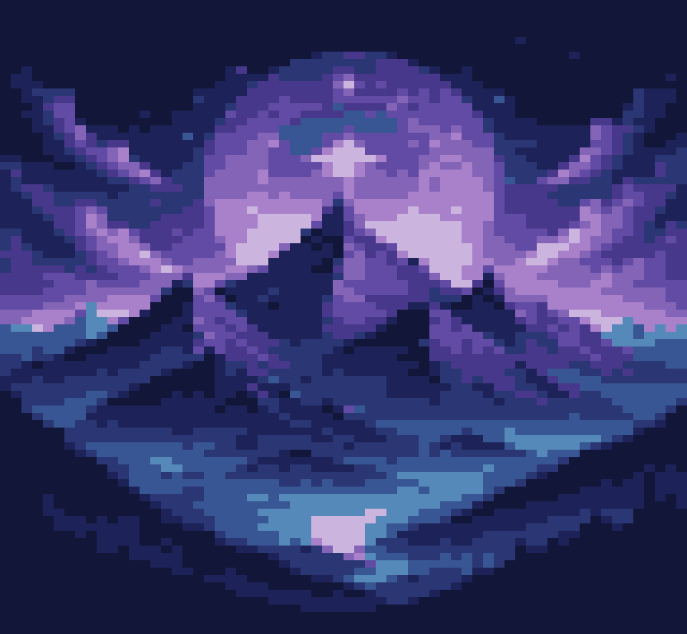
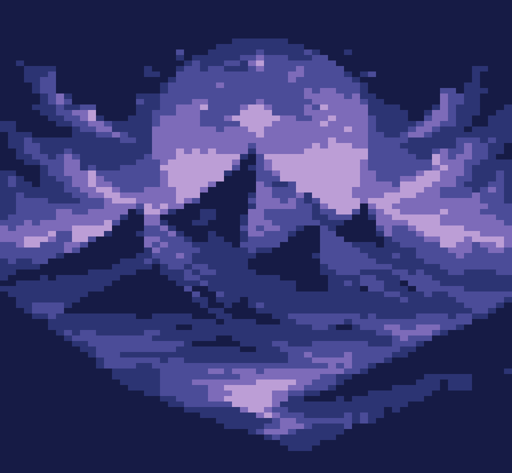
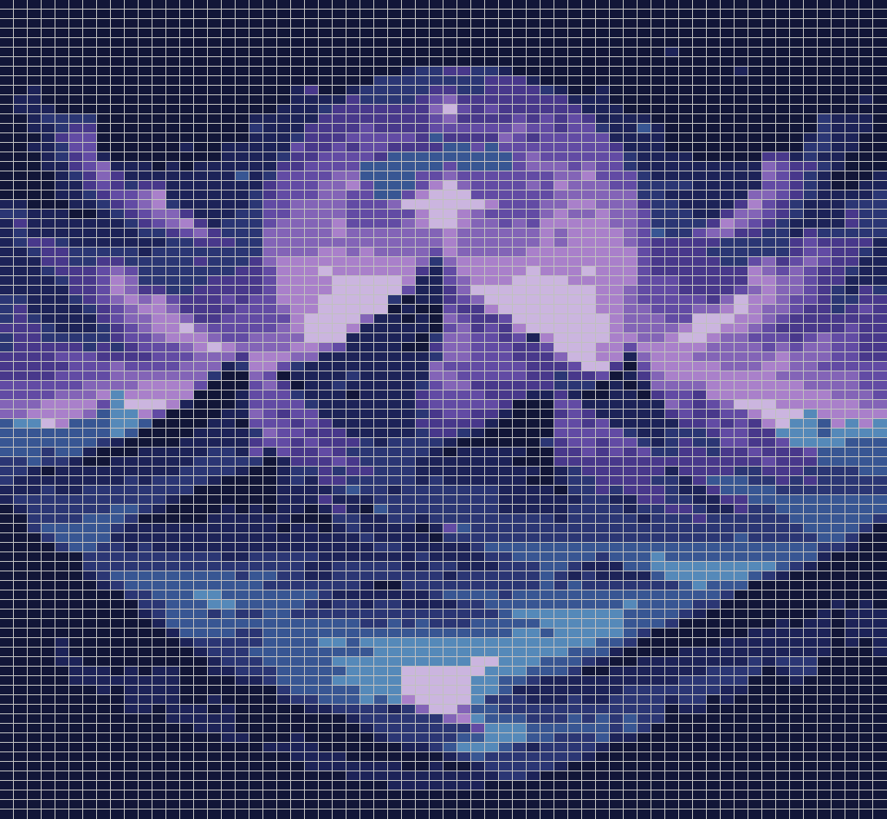

# ImagePixelator

Easily pixelate any image and move on with your work!

    

---

**Change the maximum number of colors (86x64 grid)**

    
    
    

---

**Overlay a grid on the pixels (86x64 grid)**

    
    
    

---

## Requirements
- Python 3+